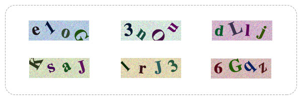

# Generating Verification Code with Canvas API

Here is how it looks like:



A few things recommend to do before using the code:

1. READ and UNDERSTAND the code, detailed explainations are provided in comments. Also, check the reference links below
2. TWEAK the settings (font style, color, translate pos, rotation, scale) to however you want them to be if needed
3. HAVE FUN playing with the code, they are ALIVE!

使用代码前，推荐先做以下几件事：

1. **读懂**代码。源码中有详细的注释说明（英文），或者阅读 [我的解读文章（中文）](https://levblanc.com/js/canvas-verification-code.html) 及参考最下方的参考文章
2. 调整源码中对字体、颜色、位移、旋转、缩放的设置，以切合自己的需求
3. 代码是活的，享受每一次尝试的过程

## Usage

Copy `canvas-verification-code.js` and `codeBg.png` to your repo.

### Plain Html and Javascript

```html
<div class='verificationCode'>
  <!-- use css absolute positioning to put codeBg.png   
    underneath your verification code -->
  <div class='codeBackground'></div>
  
</div>
```

```javascript
import generateCode from '/path/to/canvas-verification-code.js'

const { code, data } = generateCode(120, 40)

window.imageData = data

// compare user input and the value of `code` for verification
```

### Using Vue.js 2.0

```pug
<template lang='pug'>
  div(class='verificationCode')
    //- use css absolute positioning to put codeBg.png   
    //- underneath your verification code
    div(class='codeBackground')
    img(
      class='codeImage'
      :src='imageData'
      alt='verificationCode'
    )
  input(v-model.trim='codeInput')
  div code input is {{ checkResult }}
</template>
```

```javascript
import generateCode from '/path/to/canvas-verification-code.js'

export default {
  data() {
    return {
      codeInput: '',
      codeImage: ''
      codeText : '',
    }
  },
  computed: {
    checkResult() {
      return this.codeText === this.codeInput
        ? 'correct'
        : 'not correct'
    }
  },
  mounted() {
    const { code, data } = generateCode(120, 40)

    this.codeImage = data
    this.codeText  = code
  }
}
```

## Params

| name    | type     | required | meaning                     | default | options |
| :-----: | :------: | :------: | :------------------------:  | :-----: | :-----: |
| width   | number   | true     | width of canvas background  |         |         | 
| height  | number   | true     | height of canvas background |         |         | 
| type    | string   | false    | type of code characters     | "default" <br/> (mix of letter and number) | "letter", "number" | 
| codeLen | number   | false    | length of code characters   | 4       | positive integers | 


## References

[1] [Math.random() @ MDN](https://developer.mozilla.org/en-US/docs/Web/JavaScript/Reference/Global_Objects/Math/random)

[2] [Generating random whole numbers in JavaScript in a specific range?](https://stackoverflow.com/questions/1527803/generating-random-whole-numbers-in-javascript-in-a-specific-range)

[3] [Canvas tutorial @ MDN](https://developer.mozilla.org/en-US/docs/Web/API/Canvas_API/Tutorial)

[4] [shoestrong/validate-code-canvas](https://github.com/shoestrong/validate-code-canvas)

[5] [KIDx/verify-code](https://github.com/KIDx/verify-code)

[6] [jovey-zheng/verify-code](https://github.com/jovey-zheng/verify-code)

[7] [F-happy/verification-code](https://github.com/F-happy/verification-code)